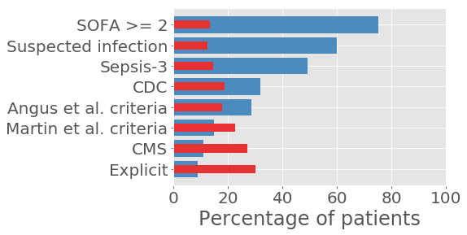

# Sepsis-3 in MIMIC-III [](https://zenodo.org/badge/latestdoi/61314230)

This is the code repository associated with [A Comparative Analysis of Sepsis Identification Methods in an Electronic Database](https://www.ncbi.nlm.nih.gov/pubmed/29303796)

The publication assessed five methods of identifying sepsis in electronic health records, and found that all five had varying cohort sizes and severity of illness as measured by in-hospital mortality rate. The results are best summarized by the following figure:



Above, we can see that, as we change the criteria used to define sepsis, the percentage of patients who satisfy the criteria decreases (blue bars) and the percent mortality of that cohort increases (red bars). For more detail please see the paper.

If you find the code useful, we would appreciate acknowledging our work with a citation: either the code directly (using the DOI badge from Zenodo), the paper summarizing the work, or both!

# Reproducing the results of the above study

Reproducing the study can be done as follows:

1. Installing necessary Python dependencies
2. Generate or acquire the CSV files which are used for analysis by...
  * Running the `sepsis-3-get-data.ipynb` notebook from start to finish
  * ... or downloading the CSV files from the MIMIC-III Derived Data Repository and analyzing those files
3. Running the analysis in `sepsis-3-main.ipynb`

The following instructions have been tested on Ubuntu 16.04, but should be relatively straightforward to adapt to other systems.

## 1. Clone the repository and install necessary Python dependencies

You will need a local copy of the code in this repository. The easiest way to acquire this is to use `git` to clone the data locally. If using Ubuntu, you can install `git` easily with:

```
sudo apt-get install git
```

Next, clone the repository with the `--recursive` flag as it relies on a distinct repository (mimic-code):

```
git clone https://github.com/alistairewj/sepsis3-mimic sepsis3-mimic --recursive
```

If you already have the repository cloned on your local computer, but you didn't use the `--recursive` flag, you can clone the submodule easily:

```
cd sepsis3-mimic
git submodule update --init --recursive
```

(Optional, recommended): Create a virtual environment for this repository. I like to use [virtualenvwrapper](https://virtualenvwrapper.readthedocs.io/en/latest/#) as it makes managing virtual environments easier. After [installing virtualenvwrapper](https://virtualenvwrapper.readthedocs.io/en/latest/install.html), run: `mkvirtualenv --python=python3 sepsis3-py3`

If you are running jupyter notebook in a different environment (e.g. you have a system level install of jupyter currently running, but want to use this virtual environment), then you can add this virtual environment as a kernel specification. From outside your virtual environment, run: `python -m ipykernel install --user --name sepsis3-py3 --display-name "sepsis3-py3"`. You can read more [about this here](https://stackoverflow.com/questions/37891550/jupyter-notebook-running-kernel-in-different-env). After installing the kernel specification, you may need to reload any active notebooks in order to see the kernel as an option.

Finally, using a package manager for Python (`pip`), you can run the following from the root directory of this repository to install all necessary python packages:

```
pip install -r requirements.txt
```

## 2. Acquire CSVs from a database with MIMIC-III

There are two options: (a) regenerate the CSVs from the original MIMIC-III database, or (b) download pre-generated CSVs from PhysioNetWorks. Both will require approval to access MIMIC-III - you can also [read more about getting access to MIMIC-III](https://mimic.physionet.org/gettingstarted/access/).

### (a) Regenerate the CSVs from a PostgreSQL database with MIMIC-III

The `sepsis-3-get-data.ipynb` notebook runs through the process of exporting the data from the database and writing it to CSV files. This notebook requires:

1. PostgreSQL version 9.4 or later
2. The MIMIC-III database installed in PostgreSQL

If you do not have the above, you can follow the [instructions on this page](https://mimic.physionet.org/gettingstarted/dbsetup/) to access and install MIMIC-III.

Once you have the database setup, you will need to generate the CSV files. The easiest way is to run through the `sepsis-3-get-data.ipynb` notebook: this will call the `query/make-tables.sql` script and generate the necessary tables on the database. Alternatively, you can run this script directly, and the notebook will recognize that the final sepsis3 table already exists. If running directly using psql, you can call:

```sh
cd query
psql
set search_path to public,mimiciii;
\i make-tables.sql
```

Either way, the generation of all the tables can take anywhere from 10 minutes to about an hour, depending on your system. You may see a lot of `NOTICE` warnings: don't worry about them. The query logic is "check if the table exists, and if it does, drop it". These warnings indicate that the table did not exist (and nor would you expect it to on a fresh install!).

### (b) Download the CSVs from the MIMIC-III Derived Data repository

The data files can be downloaded from the [MIMIC-III Derived Data Repository](https://physionet.org/works/MIMICIIIDerivedDataRepository/).

## 3. Run analysis

`sepsis-3-main.ipynb` - this analyzes the data and reports all results found in the paper. It assumes the data is available in the `data` subfolder of this directory - all notebooks do this, and you can change it if you like by modifying the `data_path` variable at the top of each script.

## (Optional) Supplemental Material

Results presented in the supplemental material can be regenerated using the `supplemental-material.ipynb` file.

## (Optional) Other notebooks

There are a number of other notebooks: `venn-diagrams.ipynb` unsurprisingly generates many Venn diagrams, `criteria-over-time.ipynb` and the `appendix` subfolder contains a number of notebooks/R scripts which contain some interesting analyses but may not work out of the box.
Pull requests welcome! :)
